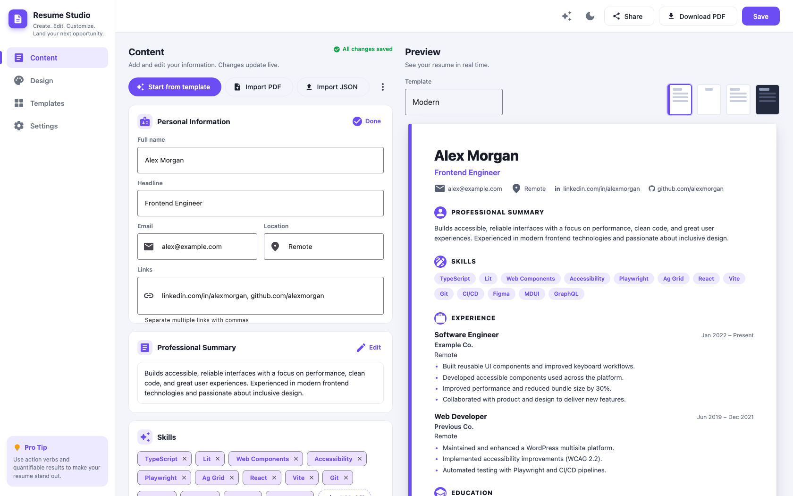

<div align="center">

# 📄 Resume Studio

**Create. Edit. Customize. Land your next opportunity.**

A fast, private resume builder that runs entirely in your browser — no accounts, no servers, no tracking.

[](https://lit.dev)
[](https://www.typescriptlang.org)
[](https://vite.dev)
[](https://www.mdui.org)
[](https://pnpm.io)
[](https://vitest.dev)
[](LICENSE)
[](https://github.com/melissaspiegel/resume-studio/pulls)



</div>

## ✨ Features

- 📝 **Section-based editor** — personal info, summary, skills chips, work experience, and education cards
- 👁️ **Live preview** — every keystroke updates the resume instantly
- 🎨 **4 templates + accent colors** — Modern, Classic, Minimal, and Bold
- 🌙 **Dark mode** — for the editor; the resume stays print-ready
- 📥 **PDF & JSON import** — pull in an existing resume or a saved draft
- 💾 **Autosave** — your draft lives in `localStorage`, exportable as JSON
- 🖨️ **Print to PDF** — pixel-perfect output via the browser's print dialog
- 🔒 **Private by design** — everything runs client-side; nothing is uploaded
- ♿ **Accessible** — semantic landmarks, heading structure, light-DOM rendering

## 🚀 Quick start

```sh
pnpm install
pnpm dev      # → http://localhost:5173
pnpm test     # vitest
pnpm build    # tsc --noEmit + vite build
```

Edit fields in the **Content** panel — the preview and autosave update live. Sections have an **Edit/Done** toggle; skills are chips you can delete or add; experience and education entries have an inline editor via their **⋯** menu. **Import PDF**/**Import JSON** restore a draft; the **⋯** menu offers **Download JSON** and **Blank resume**. **Templates** and **Design** in the sidebar switch the resume template and accent color; **Settings** has dark mode and draft management. **Download PDF** opens the browser print dialog — choose "Save as PDF". Test page breaks before sending a resume.

## ⚠️ PDF import: what it actually does

Import a text-based PDF to extract its text with PDF.js. The extraction lands in an **Imported PDF text** field for review. The first line is proposed as the name. Move content into the structured fields yourself. Multi-column layouts, glyphs, reading order, and line breaks can be inaccurate. Image-only/scanned PDFs require OCR, which is not included. Importing a PDF does **not** reproduce its original design or turn arbitrary layout into an editable template. For reliable future editing, retain the downloaded JSON alongside the PDF.

## 🏗️ Architecture

- `src/resume/`: the data layer, split by concern — `resume.types.ts` (schema), `resume.defaults.ts` (`emptyResume`), `resume.parser.ts` (`parseResume` validation + `textToDraft`), `resume.migrations.ts` (v1 draft migration), `resume.normalizers.ts` (shared `toString`/`toId`/`toStringArray`/`normalize*` helpers), `resume.fixtures.ts` (`sampleResume`). `index.ts` re-exports the public API.
- `src/pdf.ts`: local PDF text extraction, no server upload.
- `src/main.ts`: Lit app shell — sidebar nav, topbar actions, section-card editor, and a live template-aware preview. Renders in **light DOM** (`createRenderRoot() { return this; }`) so headings and landmarks are exposed to assistive tech and a11y linters; app styles live in `src/app.css` scoped under `resume-app`. Icons come from `@mdui/icons` (SVG components, no icon font).
- `tests/model.test.ts`: data validation, v1 migration, and PDF draft mapping.
- Browser print generates the PDF from the same structured preview, so formatting remains under your control.

## 🗺️ Roadmap

- [ ] Split `resume-app` into editor, section-card, and preview components; add focus management around import and status messages.
- [ ] Add Projects, Certifications, and links sections; drag-to-reorder entries (grip handles are visual only today).
- [ ] Add multiple named resumes, schema versioning/migrations, and explicit autosave/error handling. Consider IndexedDB for larger drafts.
- [ ] Refine templates: paper-size controls, page-break handling, and per-template font pairing.
- [ ] Improve import: identify contact details and section headings from PDF text, present suggested mappings for confirmation, and preserve original extracted text. Add fixture PDFs and tests for reading order.
- [ ] Add an optional OCR path for scanned PDFs, with a visible privacy and processing choice.
- [ ] Add JSON import/export version checks, recovery UI, and a way to delete local drafts.
- [ ] Verify keyboard editing, focus, screen-reader labels, zoom, and PDF text selection; test printed output in Chrome/Safari and ATS parsing.
- [ ] If exact PDF layout editing is required, scope a separate PDF annotation/editor feature. PDF text extraction cannot reconstruct an arbitrary source layout.
